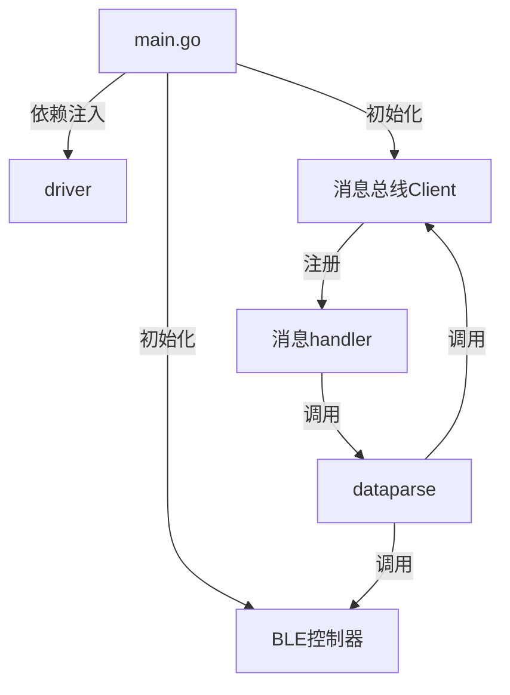

当然可以！下面我用简明的方式，帮你梳理**device-ble-go**项目的整体运行逻辑和各核心模块的关系。

---

## 1. **项目启动入口（main.go）**

- **main.go** 是整个服务的启动入口。
- 主要负责**组装依赖**（配置、日志、串口、BLE 控制器、消息总线 client）、注册消息 handler，并将这些依赖注入到 driver。

**主要流程：**
1. 读取/组装配置（串口、MQTT等参数）。
2. 创建 logger。
3. 初始化串口和串口队列。
4. 初始化 BLE 控制器。
5. 初始化消息总线（MQTT）客户端。
6. 注册消息 handler（收到消息时的业务处理逻辑）。
7. 组装 driver 并启动 EdgeX 设备服务。

---

## 2. **核心依赖与解耦**

- **依赖注入**：所有依赖（如 BLE 控制器、消息总线 client）都在 main.go 组装好后，通过结构体字段传递给 driver，driver 只负责业务，不负责依赖创建。
- **接口驱动**：各核心依赖都通过接口（如 `MessageBusClient`、`BLEController`）解耦，方便后续扩展和测试。

---

## 3. **消息总线（MQTT）处理流程**

- main.go 注册了一个 handler 到消息总线 client。
- 当有消息到达时，handler 会被自动调用，执行如下逻辑：
  1. 解析消息内容（JSON 反序列化）。
  2. 通过 dataparse 包将数据发布到消息总线（如需要转发）。
  3. 通过 dataparse 包将数据发送到 BLE 设备（通过串口）。

---

## 4. **driver 的职责**

- driver 负责协调 EdgeX SDK 的生命周期（初始化、启动、停止等）。
- driver 通过注入的依赖（如 BLE 控制器、消息总线 client）完成实际的设备操作和消息处理。
- driver 不再负责 handler 的注册和消息总线的初始化，这些都在 main.go 完成。

---

## 5. **各包关系简图**

---

## 6. **运行时典型流程**

1. 服务启动，main.go 初始化所有依赖。
2. main.go 注册消息 handler 到消息总线。
3. driver 启动，等待 EdgeX SDK 调用。
4. 有消息到达时，handler 被调用，完成数据解析、转发和 BLE 发送。
5. 其他 EdgeX 相关命令（如设备发现、读写命令）由 driver 通过接口实现。

---

## 7. **你需要关注的重点**

- **main.go**：依赖组装、handler 注册、服务启动。
- **pkg/mqttbus**：消息总线 client 的实现，负责订阅和发布。
- **pkg/dataparse**：数据解析与转发逻辑，连接消息总线和 BLE 控制器。
- **internal/driver**：EdgeX 设备服务的业务协调者，负责生命周期管理和命令处理。

---

如果你有具体想了解的某个流程或包的细节，可以告诉我，我可以帮你画更细的流程图或代码调用关系！